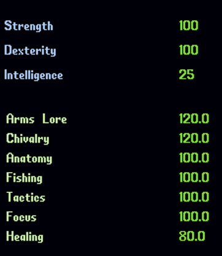
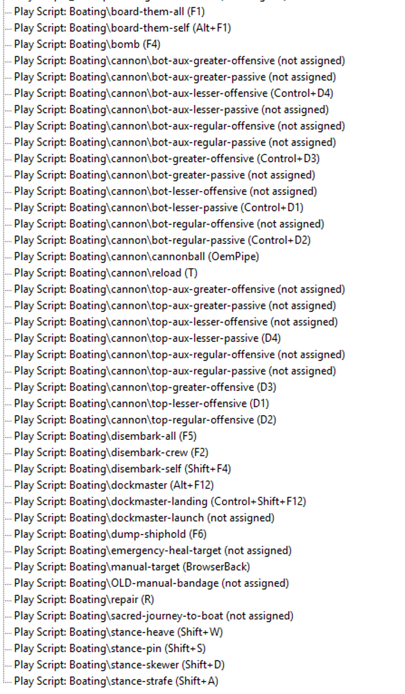

# Overview
Tallisado pooner boating automation.

## Summary of features
- Auto Launch (Open bags/menus, Use Aspects, set hold, chiv gate for atk speed, etc)
- Auto heal loop (crew, self, and focused crew to break loop)
- Auto Repair (when sinking a ship, repairs and reloads for you)
- Deaths door Frost Shield (dumps into frost armor to stay alive)
- Auto pots, chiv abiliies
- Uses weapon ability when boarding npc ship
- Auto loot enemy hold, and auto dump into your hold (rotate boat if your hold is not found)
- Auto glass on less frequent timer than in-game checkbox

### manual-target

- focus fire botth npc and pvp crew, as well as auto fire cannon toward their boats
- loops a heal on a target friendly until full, then go back to crew loop

## I'm running this

## My keybindings

